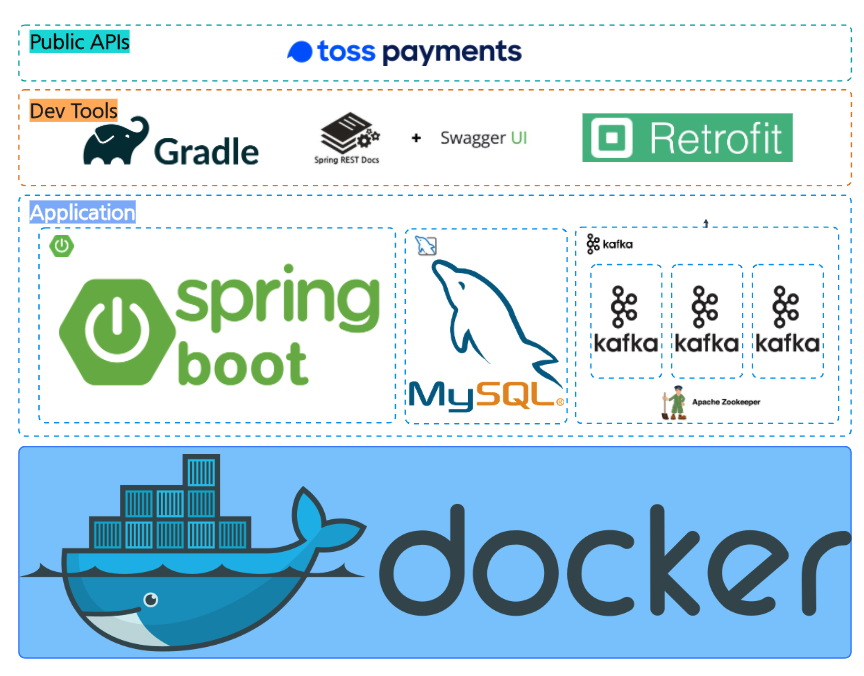
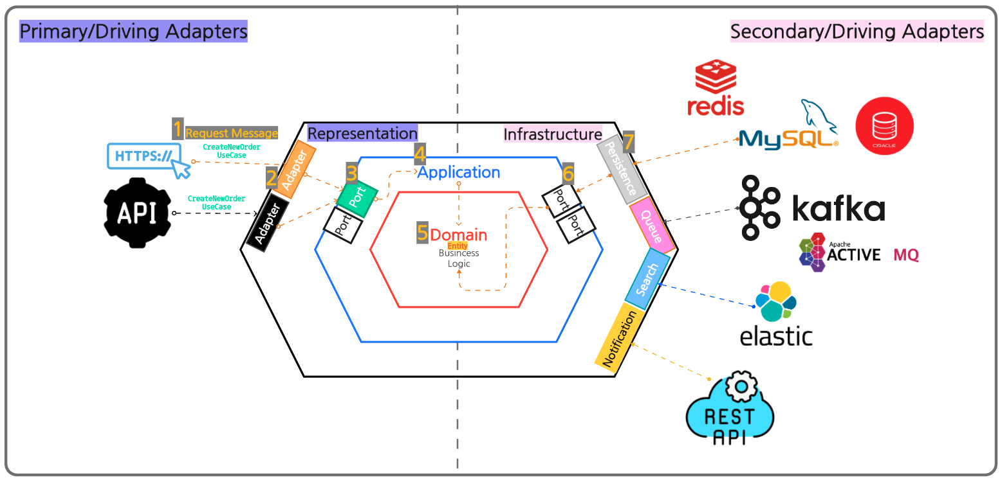
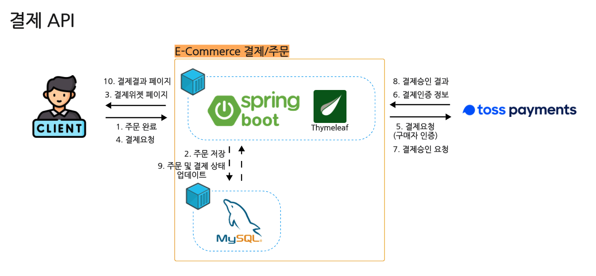
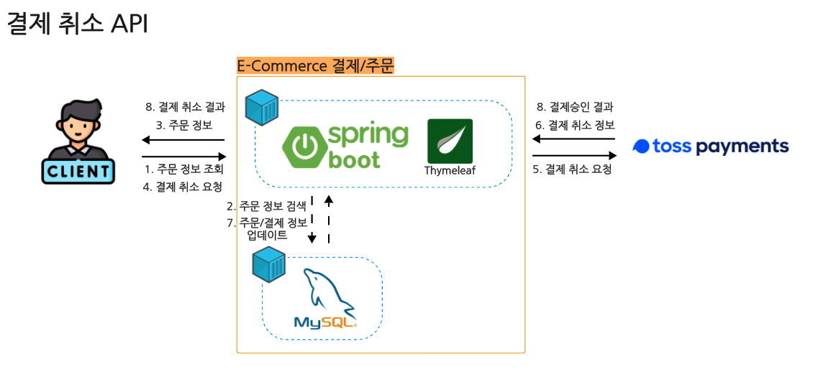
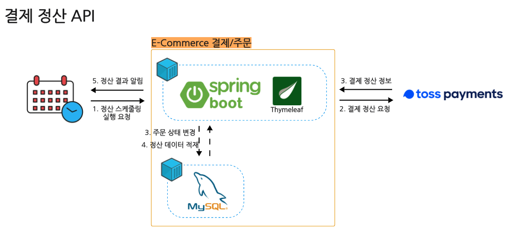
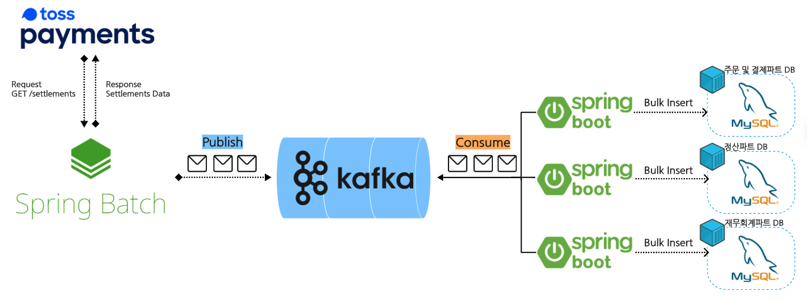

# Kafka Payment Service

Kafka를 활용한 DDD 기반 E-Commerce 결제 서비스

<!-- prettier-ignore-start -->

<!-- prettier-ignore-end -->

### System Requirements

- [java] 17
- [springboot] 3.5.8
- [docker] 29.1.1
- [kafka] 7.3.10
- [zookeeper] 7.3.10
- [mysql] 6.0.16

## Swagger UI (Rest Doc + Swagger UI)

http://localhost:8080/swagger-ui.html

## 개발 방법론
우리의 세상은 빠르게 변하고 그렇기 때문에 우리가 개발하는 Applicaton 또한 이런 변화에 빠르게 적응 할 수 있어야 한다. 
특히, 결제시스템은 더 트렌드에 민감하다. 그래서 우리는 TDD와 DDD를 이용해서 변화에 잘 적응할 수 있는 Architecture 설계부터 Application 구현까지 해보면 
최근 기업들이 추구하는 "지속 가능한 소프트웨어"란 무엇인가를 배워 볼 수 있는 기회가 되지 않을까 싶다. 
1. TDD: TDD는 비즈니스의 변경으로 발생하는 변경사항을 코드에 빠르게 적용하고 테스트 해 볼 수 있으며, 이를 통해 개발자의 불안감을 감소 시켜줄 수 있다. 
2. DDD: DDD 기반의 헥사고날 아키텍처는 우리가 개발하는 Application이 변경에 유연하고 확장성을 가질 수 있도록 도와준다. 

## 아키텍처
### Hexagonal architecture

## 이커머스 주문/결제 시스템
PG사 TEST API 연동(+결제위젯)
### 결제 기능 개발 - TDD 기반 카드 결제 승인 기능

### 결제 기능 개발 - TDD 기반 카드 결제 취소 기능

### 결제 기능 개발 - TDD 기반 카드 결제 정산 기능

## 정산 기능 고도화 with Kafka
